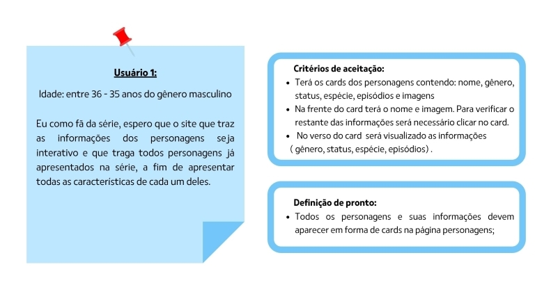
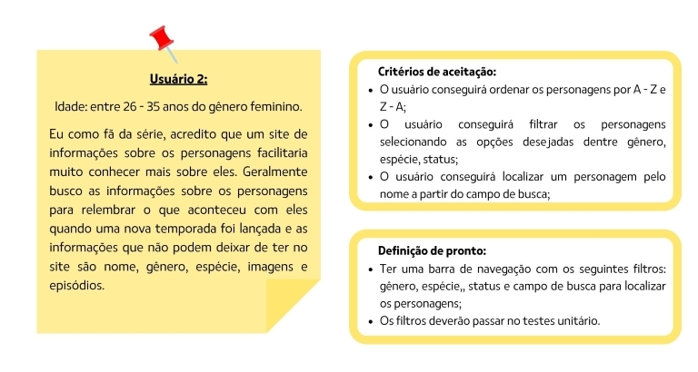
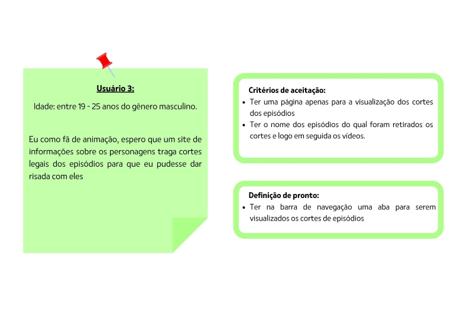
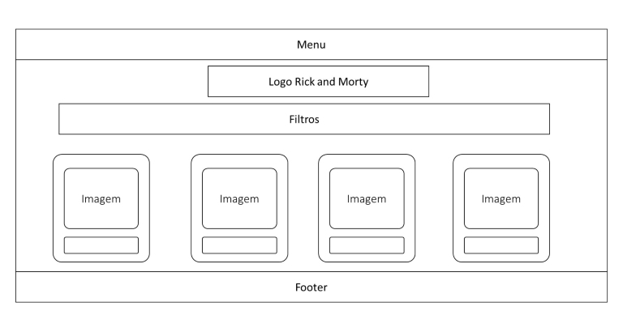
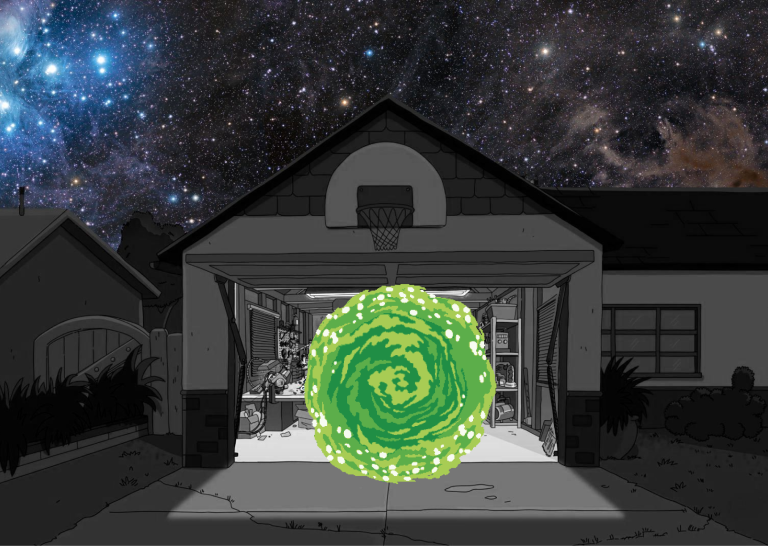
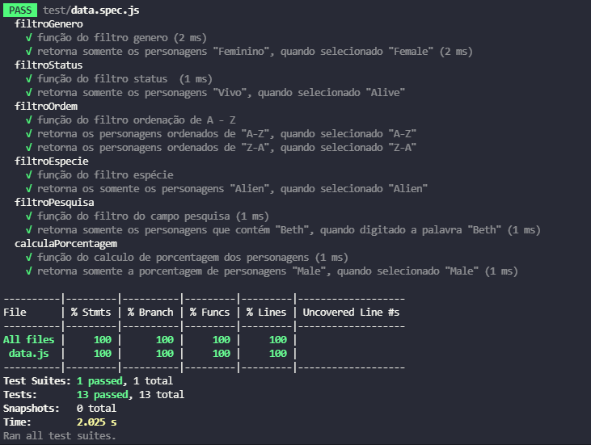
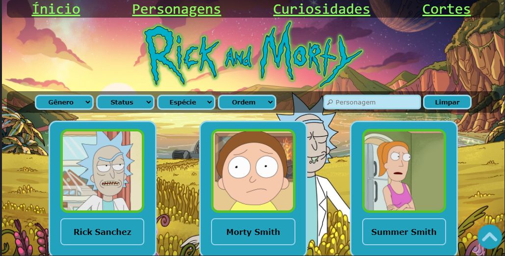
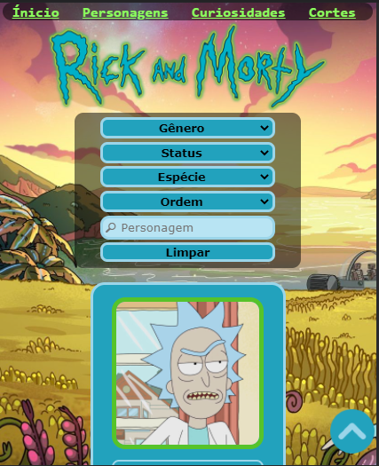

# Rick and Morty

## Índice

- [1. Introdução](#1-Introdução)
- [2. Resumo do projeto](#2-resumo-do-projeto)
- [3. Definição de produto](#3-definição-de-produto)
- [4. Testes unitários](#4-testes-unitários)
- [5. Resultado](#5-Resultado)

---

## 1.Introdução

[Rick and Morty](https://pt.wikipedia.org/wiki/Rick_and_Morty) é uma série animada de  comédia e ficção científica que mostra as aventuras interdimensionais, estreou em dezembro de 2013.  A história apresenta as aventuras de Rick Sanchez, um cientista extremamente inteligente e alcoólatra de 60 anos, com seu neto Morty Smith, que possui dificuldades escolares e tem 14 anos

Inspirado em “De Volta Para o Futuro”, o desenho mistura elementos do mundo “real” com as viagens da dupla protagonista por outras dimensões e universos paralelos.

Para visualizar o projeto [clique aqui](https://flavia-dantas.github.io/SAP007-data-lovers/)

## 2. Resumo do projeto

O projeto desenvolvido foi uma página web para visualizar um conjunto de dados sobre os personagens Rick and Morty que se adeque às necessidades de usuário. A pagina possibilita visualizar 493 personagens  da série e filtrá-los  por Gênero, Status, Espécie e Ordem de A-Z ou de Z-A. No verso do card é possível ver algumas informações relevantes do personagem e os episódios que aparecem.

## 3. Definição de produto

O site foi desenvolvido para atender os fãs da série Rick and Morty de forma prática e simples, onde o usuário poderá visualizar os personagens em formato de card e as informações relevantes no verso no card. Permitindo localizar os personagens através de uma busca por nome, filtro por gênero, status e espécie, e ordenação. E ao clicar no card trás algumas informações relevantes como gênero, status, espécie, localização e em quais episódios o personagem aparece.

### Histórias de usuário

Para atender os usuários, foi realizado uma pesquisa foi utilizado **Google Forms** com o objetivo de entender os fãs e curiosos da série, identificando a faixa etária e gênero dos usuários, e quais são os seus interesses em relação aos personagens e o tipo de informação que consideram relevantes na série. Abaixo é possível visualizar os três perfis definidos para o projeto.

### Desenho de interface do usuário

#### Protótipo de baixa fidelidade

Após a definição das histórias de usuário, foi criado um protótipo de baixa fidelidade, conforme abaixo.

#### Protótipo de alta fidelidade

O próximo passo foi desenhar uma Interface de Usuário (UI - *User Interface*). Para isso, foi utilizado a ferramenta **Figma** .

Tela inicial:

Pagina Personagens:

#### **Paleta de cores**

A paleta de cores foram definidas através das cores principais da série

#### Testes de usabilidade

Foi implementado um botão de voltar ao topo da pagina, por ser uma pagina longa causada pelos 493 personagens sendo exibidos na tela, após os usuários encontrar dificuldades ao voltar no topo da pagina para realizar um novo filtro.

#### Interface de usuário

Após desenhar interface de usuário, iniciou-se a implementação do projeto, que ficou da seguinte forma:

- Mostrar os dados dos personagem em formato de cards.

- Permitir ao usuário interagir com a interface para obter as informações que
  necessita;
- Ser _responsiva_, ou seja, deve ser visualizada sem problemas a partir de
  diversos tamanhos de tela: celulares, tablets, notebooks, etc.

- Implementação de filtros e campo de busca por nome do personagem.

## 4. Testes unitários

Os testes unitários foram desenvolvidos para testar as funções encarregadas de _processar_,
_filtrar_ e _ordenar_ os dados, assim como _o calculo agregado_. Os testes cobrem 100% de _statements_
(_sentenças_), _functions_ (_funções_), _lines_ (_linhas_), e _branches_ (_ramos_).

## 5. Resultado

Versão para desktop / notebook:

Versão responsiva para Tablet:

Versão responsiva para celular:

